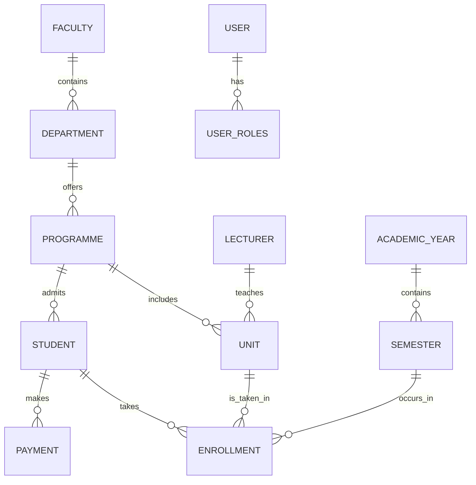
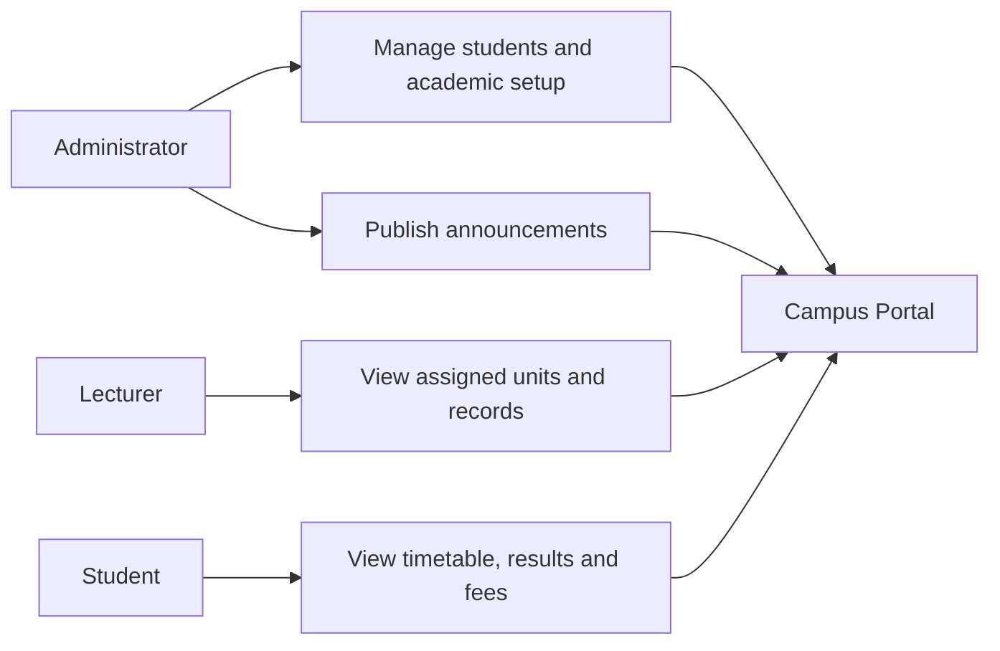
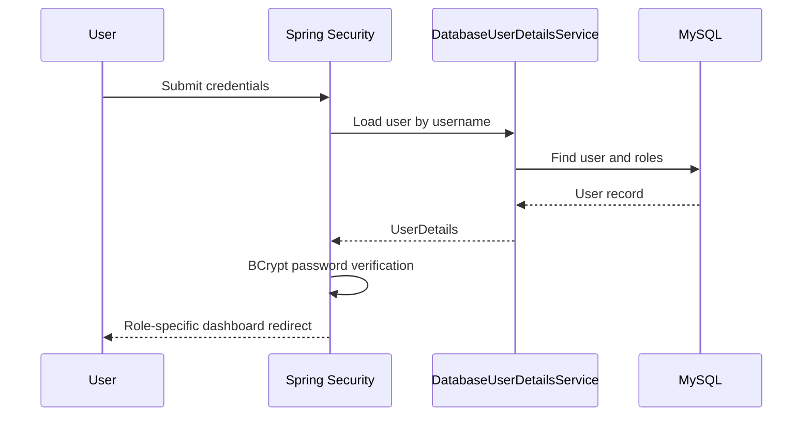

# Architecture diagrams

## Core ER model

```mermaid
erDiagram
  FACULTY ||--o{ DEPARTMENT : contains
  DEPARTMENT ||--o{ PROGRAMME : offers
  PROGRAMME ||--o{ STUDENT : admits
  PROGRAMME ||--o{ UNIT : includes
  STUDENT ||--o{ ENROLLMENT : takes
  UNIT ||--o{ ENROLLMENT : is_taken_in
  ACADEMIC_YEAR ||--o{ SEMESTER : contains
  SEMESTER ||--o{ ENROLLMENT : occurs_in
  STUDENT ||--o{ PAYMENT : makes
  LECTURER ||--o{ UNIT : teaches
  USER ||--o{ USER_ROLES : has
```

## Use cases

```mermaid
flowchart LR
  A[Administrator] --> B[Manage students and academic setup]
  A --> C[Publish announcements]
  L[Lecturer] --> D[View assigned units and records]
  S[Student] --> E[View timetable, results and fees]
  B --> F[Campus Portal]
  C --> F
  D --> F
  E --> F
```

## Login sequence

```mermaid
sequenceDiagram
  participant U as User
  participant S as Spring Security
  participant D as DatabaseUserDetailsService
  participant DB as MySQL
  U->>S: Submit credentials
  S->>D: Load user by username
  D->>DB: Find user and roles
  DB-->>D: User record
  D-->>S: UserDetails
  S->>S: BCrypt password verification
  S-->>U: Role-specific dashboard redirect
```
